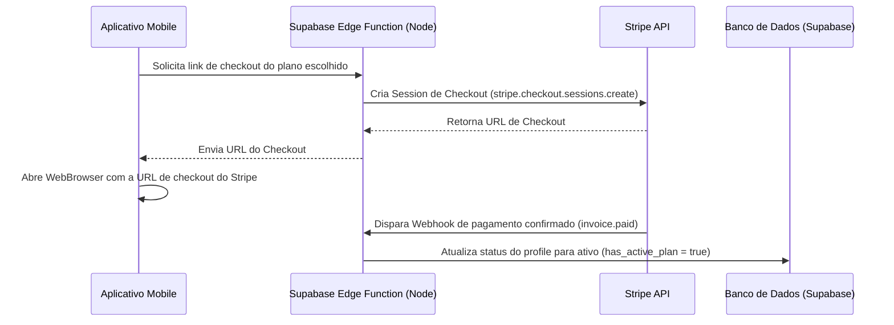

# FitApp 🏋️‍♂️

Aplicativo mobile white-label e multi-tenant lógico construído com **Expo (React Native)** e **Supabase** para Personal Trainers gerenciarem alunos, fichas de treino, evolução física e assinaturas.

---

## 🚀 Como Rodar o Projeto

Siga as etapas abaixo para preparar o ambiente local e executar o aplicativo no simulador ou dispositivo físico.

### 1. Instalar as Dependências
Abra o terminal no diretório do projeto e execute:
```bash
npm install
```

### 2. Configurar Variáveis de Ambiente
Crie um arquivo `.env` na raiz do projeto contendo as credenciais de desenvolvimento do Supabase:
```env
EXPO_PUBLIC_SUPABASE_URL=https://sua-url-do-supabase.supabase.co
EXPO_PUBLIC_SUPABASE_ANON_KEY=seu-token-anon-key-aqui
```

### 3. Executar o Servidor de Desenvolvimento
Inicie o servidor local do Expo:
```bash
npm run start
```
No terminal, pressione:
- `a` para rodar no simulador do **Android**.
- `i` para rodar no simulador do **iOS** (macOS necessário).
- Escaneie o QR Code exibido com o app **Expo Go** no celular físico para testar em tempo de execução real.

---

## 🔌 Integração com o Supabase

### 1. Criar Tabelas e RLS
Acesse o painel do seu projeto no **Supabase Console** -> **SQL Editor** e cole o conteúdo completo do arquivo:
👉 [supabase-schema.sql](file:///Users/mateusfernandesabukamel/Documents/FitApp/supabase-schema.sql)

Esse script irá:
- Criar a estrutura completa das tabelas (`profiles`, `personal_themes`, `students_relationship`, `workouts`, `workout_exercises`, `student_progress`).
- Habilitar **Row Level Security (RLS)** em todas as tabelas.
- Criar Triggers para criar automaticamente perfis de usuário (`profiles`) ao registrar-se com o Supabase Auth.
- Configurar políticas seguras de acesso para que os alunos vejam apenas seus treinos e o tema do seu respectivo personal trainer.

---

## 💳 Integração com Stripe (Pagamentos & Planos)

Para disponibilizar a contratação de planos e cobranças recorrentes para os Personal Trainers, integramos o fluxo de checkout e controle de assinaturas.

### Arquitetura de Pagamentos Recomendada:


### Como Ativar em Produção:

1. **Instalar Dependências Adicionais**:
   Caso opte pelo fluxo nativo em vez de redirecionamento via WebBrowser (Stripe Checkout), instale o SDK oficial do Stripe para React Native:
   ```bash
   npx expo install @stripe/stripe-react-native
   ```

2. **Criar e Configurar Webhooks**:
   Crie uma **Edge Function** no Supabase para escutar os webhooks do Stripe. Isso garante que a assinatura do Personal Trainer seja ativada no banco de dados assim que o Stripe confirmar o pagamento.
   - Exemplo de Webhook (Node/Deno):
     ```typescript
     const stripe = require('stripe')(Deno.env.get('STRIPE_SECRET_KEY'));
     
     // Tratar evento invoice.paid
     if (event.type === 'invoice.paid') {
       const session = event.data.object;
       const customerEmail = session.customer_email;
       // Atualiza a tabela 'profiles' setando 'has_active_plan' para true
     }
     ```

3. **Vincular Chaves no App**:
   Passe as chaves públicas nos ambientes correspondentes para habilitar os fluxos de pagamento reais.

---

## 🧪 Como Executar Testes Automatizados

Os testes de utilitários de validação, componentes customizados (Button) e stores globais Zustand podem ser executados com:
```bash
npm run test
```
Para ver o relatório de cobertura detalhado das linhas de código testadas:
```bash
npm run test -- --coverage
```
